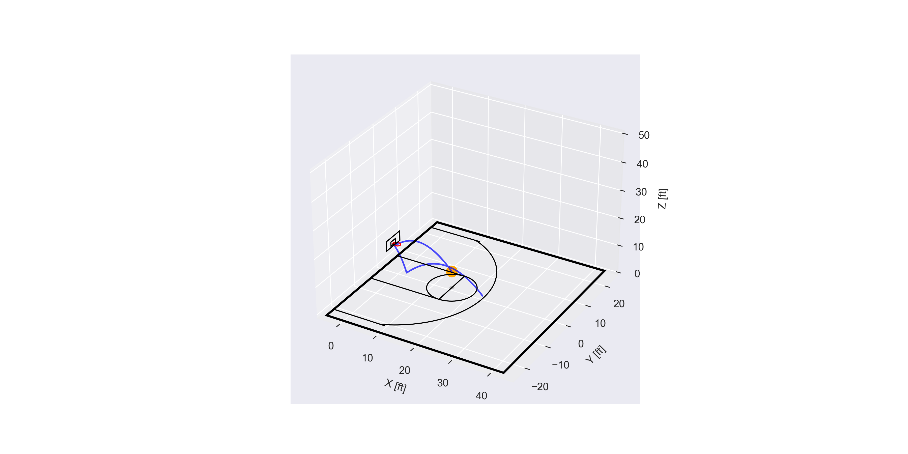
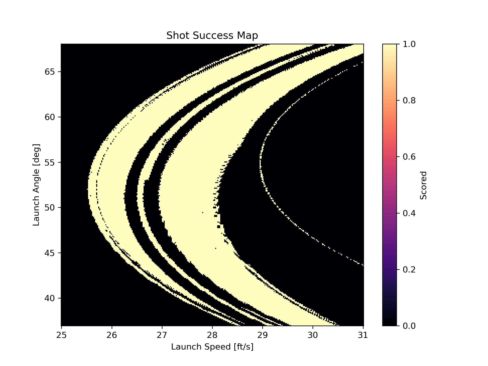

# Basketball Shot Simulation

Dynamical simulation and visualization of a basketball shot using a 4th-order Runge-Kutta (RK4) integrator. This codebase models the complex physics of a basketball flight, including gravity, drag crisis, Magnus effect, and discrete collisions with spin-dependent friction.



## Features
- **High-Accuracy Physics**: Uses an **RK4 Integrator** and directional impulse handlers with spin-dependent friction for realistic trajectory and bounces.
- **Vectorized Analysis**: Run parameter sweeps at **1,000+ shots per second** using NumPy.
- **Interactive Visualization**: 3D court rendering with optional animation (`--animate`) and physics debugging (`--debug`).
- **Command-Line Interface**: Easily test different shot parameters from the terminal.
- **Unit Tests**: Built-in physics validation for energy conservation and scoring logic.

---

## How to Use

### 1. Single Shot Simulation (`simulate.py`)
Run a single shot with custom parameters directly from the CLI:

```bash
# Run a standard free throw
python3 simulate.py -v 26 -a 56

# Animate a high-arc 3-pointer
python3 simulate.py -x 23.75 -v 30 -a 60 --animate

# Debug physics (drag, lift, and spin coefficients)
python3 simulate.py --debug
```

**Available Flags:**
- `-x`, `-y`, `-z`: Initial position [ft] (Origin is the center of the rim).
- `-v`, `--speed`: Launch speed [ft/s].
- `-a`, `--angle`: Vertical launch angle [deg].
- `-s`, `--side`: Side angle deviation [deg].
- `-w`, `--spin`: Backspin [rev/s].
- `--animate`: Toggles 3D animation.
- `--debug`: Shows time-series plots of position, velocity, and aerodynamic forces.

### 2. High-Speed Analysis (`vectorized_analysis.py`)
To map out the "success space" (which combinations of speed and angle result in a score), use the vectorized simulator:

```bash
# Run a sweep
python3 vectorized_analysis.py -nx 300 -ny 300 --save
```
This produces a success heatmap like the one below:



### 3. Running Tests
Validate the physics engine using the automated test suite:
```bash
python3 -m unittest discover tests
```

---

## Physical Model

The simulation computes the ball's trajectory by integrating the following forces:

### 1. Continuous Forces
The total acceleration **a** is given by:

$$ \mathbf{a} = \mathbf{g}_{eff} + \frac{\mathbf{F}_d + \mathbf{F}_m}{m} $$

*   **Gravity & Air Buoyancy**: $\mathbf{g}_{eff} = 0.985 \cdot \mathbf{g}$ (accounts for the upward buoyancy of the air).
*   **Aerodynamic Drag**: $ \mathbf{F}_d = -\frac{1}{2} C_D \rho A |\mathbf{v}| \mathbf{v} $
    *   The drag coefficient $C_D$ transitions from 0.5 to 0.2 between $Re=10^5$ and $Re=2 \cdot 10^5$ (Drag Crisis).
*   **Magnus Effect (Lift)**: $ \mathbf{F}_m = \frac{1}{2} C_L \rho A R (\mathbf{\omega} \times \mathbf{v}) $
    *   $C_L$ is an affine function of the spin factor $Sp = \frac{\omega R}{|\mathbf{v}|}$.

### 2. Collision Model
Collisions are modeled as discrete impulse changes using **Velocity-Direction Masking**. A collision triggers only if the ball center is within the contact radius $R$ and moving into the surface ($\mathbf{v} \cdot \mathbf{n} < 0$).

#### Impulse Components:
*   **Normal Reflection**: $ \Delta \mathbf{v}_n = -(1 + e) (\mathbf{v} \cdot \mathbf{n}) \mathbf{n} $
*   **Tangential Friction**: $ \Delta \mathbf{v}_t = -\min(\mu_f |\Delta \mathbf{v}_n|, |\mathbf{v}_{t,pt}|) \frac{\mathbf{v}_{t,pt}}{|\mathbf{v}_{t,pt}|} $
    *   $\mathbf{v}_{t,pt}$ is the tangential velocity of the ball's **surface** at the contact point, including spin: $ \mathbf{v}_{pt} = \mathbf{v} + \mathbf{\omega} \times (-R\mathbf{n}) $.

#### Angular Momentum Update:
Friction generates a torque that changes the ball's spin:

$$ \Delta \mathbf{\omega} = \frac{-R\mathbf{n} \times (m \Delta \mathbf{v}_t)}{I} $$

where $I = 0.66 m R^2$ is the moment of inertia.

---

## References
- **"On the Size of Sport Fields"** (Texier et al.) - Drag crisis data.
- **"Identification of basketball parameters for a simulation model"** (Okubo, Hubbard) - Lift coefficients and Cd values.

All physical constants are centralized in `constants.py`.
